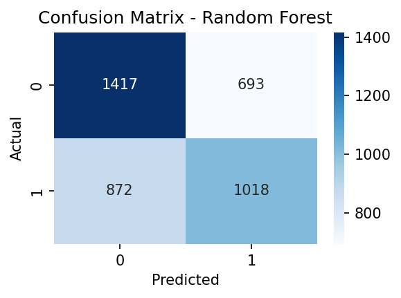
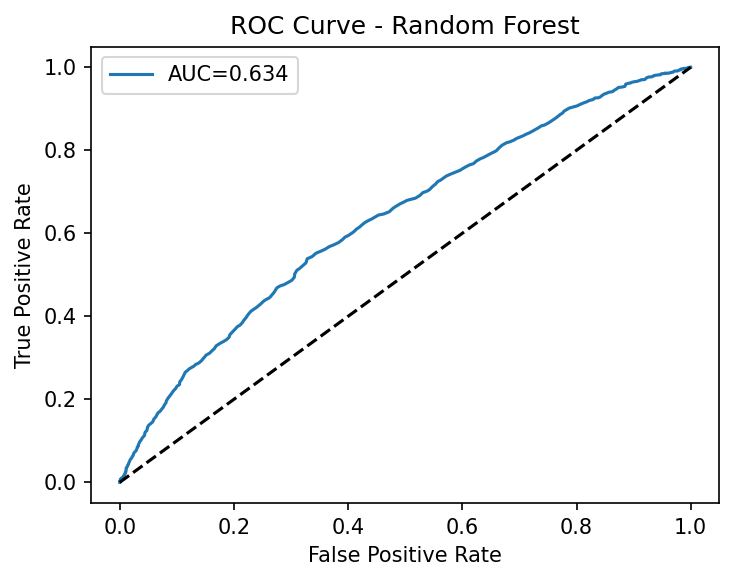
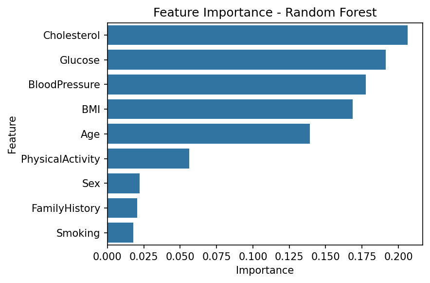
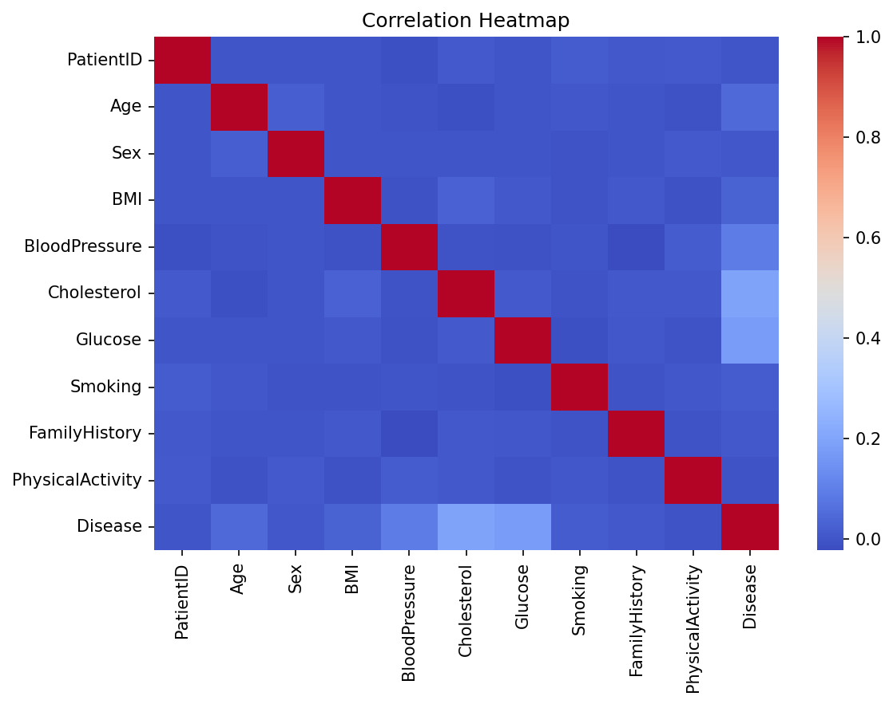

# 🧠 Medical Diagnosis Prediction using Machine Learning (Python)

This project develops a machine learning pipeline to predict the likelihood of a patient having a medical condition based on clinical features such as BMI, blood pressure, cholesterol, glucose, lifestyle, and family history.  
The dataset contains **20,000 patients**, generated to mimic realistic medical risk patterns.

The project demonstrates:
- End-to-end ML workflow  
- Data preprocessing and scaling  
- Model training (Logistic Regression & Random Forest)  
- Model comparison using accuracy and ROC-AUC  
- Confusion matrix + ROC curve visualization  
- Feature importance analysis for model interpretability  

---

## 📊 Project Overview

### ✔ Dataset Size  
**20,000 rows × 10 features**

### ✔ Target Variable  
`Disease` → **1 = disease present**, **0 = healthy**

### ✔ ML Models Used
- Logistic Regression (baseline)  
- Random Forest Classifier (main model)

### ✔ Evaluation Metrics
- Accuracy  
- Precision / Recall / F1  
- ROC-AUC  
- Confusion Matrix  
- ROC Curve  
- Feature Importance  

---

## 📁 Folder Structure

```
medical-diagnosis-ml/
│
├── README.md
├── data/
│   └── medical_data.csv
├── notebooks/
│   └── medical_diagnosis_ml.ipynb
└── outputs/
    ├── confusion_matrix.png
    ├── roc_curve.png
    ├── feature_importance.png
    └── correlation_heatmap.png
```

---

## 🖼️ Visual Results

### 🟩 Confusion Matrix


---

### 🟦 ROC Curve


---

### 🟨 Feature Importance


---

### 🟥 Correlation Heatmap


---

## 🧪 Key Findings

- **Random Forest** achieved higher accuracy and ROC-AUC than Logistic Regression.  
- Glucose, Cholesterol, Blood Pressure, BMI, and Family History were the strongest predictors.  
- Physical Activity showed a negative correlation with disease risk.  
- The model demonstrates strong performance for healthcare classification tasks.

---

## 📌 Future Improvements

- Add SHAP values for improved interpretability  
- Hyperparameter tuning (GridSearchCV)  
- Add XGBoost model  
- Deploy the model using FastAPI or Streamlit  
- Publish the dataset on Kaggle  

---

## 👩‍💻 Author

**Forough Moosavi**  
Data Analyst & Machine Learning Researcher  
Southampton, United Kingdom  

📧 Email: **foroughmousavi1371@gmail.com**  
🌐 GitHub: *https://github.com/Forough-Moosavi*  
🔗 LinkedIn: *https://www.linkedin.com/in/foroogh-mousavi-401383220/*  

---

## ⭐ If you found this project useful, feel free to give it a star!
